# @antv/expr

Have you ever wanted to use some dynamic JS capabilities when using the ssr chart library but were afraid of data security?

Now we have solved this problem for you. We have designed a simple and easy-to-understand template syntax to help you achieve dynamic rendering of charts.

## Features

- 🔒 **Secure by default** - No access to global objects or prototype chain, does not use `eval` or `new Function`
- 🚀 **High performance** - Supports pre-compilation of expressions for improved performance with repeated evaluations
- 🛠️ **Extensible** - Register custom functions to easily extend functionality
- 🪩 **Lightweight** - Zero dependencies, small footprint, only `7.8KB`

## Installation

```bash
npm install @antv/expr
# or
yarn add @antv/expr
# or
pnpm add @antv/expr
```

## Basic Usage

### Synchronous Expression Evaluation

```typescript
import { evaluate } from '@antv/expr';

// Basic evaluation
const result = evaluate('x + y', { x: 10, y: 20 }); // returns 30

// Using dot notation and array access
const data = {
  values: [1, 2, 3],
  status: 'active'
};

const result = evaluate('data.values[0] + data.values[1]', { data }); // returns 3
```

### Pre-compiling Expressions

```typescript
import { compile } from '@antv/expr';

// Compile an expression
const evaluator = compile('price * quantity');
const result1 = evaluator({ price: 10, quantity: 5 }); // returns 50
const result2 = evaluator({ price: 20, quantity: 3 }); // returns 60
```

### Using Asynchronous Patterns (Optional)

While the library is synchronous, you can still use asynchronous patterns if needed:

```typescript
import { evaluate } from '@antv/expr';

// Wrap evaluation in an async function
async function asyncEvaluate(expr, context) {
  return new Promise((resolve, reject) => {
    try {
      resolve(evaluate(expr, context));
    } catch (error) {
      reject(error);
    }
  });
}

// Use with async/await
const result = await asyncEvaluate('x + y', { x: 10, y: 20 }); // returns 30
```

### Registering Custom Functions

```typescript
import { register, evaluate } from '@antv/expr';

// Register custom functions
register('sum', (...args) => args.reduce((a, b) => a + b, 0));
register('average', (array) => array.reduce((a, b) => a + b, 0) / array.length);

// Use custom functions in expressions
const result = evaluate('@sum(1, 2, 3, 4)'); // returns 10
const avg = evaluate('@average(data.values)', { 
  data: { values: [10, 20, 30, 40] } 
}); // returns 25
```

## Supported Syntax

### Variable References

```typescript
// Simple variable reference
const result = evaluate('x', { x: 42 }); // returns 42

// Nested property access with dot notation
const result = evaluate('user.profile.name', { 
  user: { profile: { name: 'John' } } 
}); // returns 'John'

// Array access with bracket notation
const result = evaluate('items[0]', { items: [10, 20, 30] }); // returns 10

// Mixed dot and bracket notation
const result = evaluate('data.items[0].value', { 
  data: { items: [{ value: 42 }] } 
}); // returns 42
```

### Arithmetic Operations

```typescript
// Basic arithmetic
const result = evaluate('a + b * c', { a: 5, b: 3, c: 2 }); // returns 11

// Using parentheses for grouping
const result = evaluate('(a + b) * c', { a: 5, b: 3, c: 2 }); // returns 16

// Modulo operation
const result = evaluate('a % b', { a: 10, b: 3 }); // returns 1
```

### Comparison and Logical Operations

```typescript
// Comparison operators
const result = evaluate('age >= 18', { age: 20 }); // returns true

// Logical AND
const result = evaluate('isActive && !isDeleted', { 
  isActive: true, isDeleted: false 
}); // returns true

// Logical OR
const result = evaluate('status === "active" || status === "pending"', { 
  status: 'pending' 
}); // returns true
```

### Conditional (Ternary) Expressions

```typescript
// Simple ternary expression
const result = evaluate('age >= 18 ? "adult" : "minor"', { 
  age: 20 
}); // returns 'adult'

// Nested ternary expressions
const result = evaluate('score >= 90 ? "A" : score >= 80 ? "B" : "C"', { 
  score: 85 
}); // returns 'B'
```

### Function Calls

```typescript
import { register, evaluate } from '@antv/expr';

// Register functions
register('max', Math.max);
register('formatCurrency', (amount) => `$${amount.toFixed(2)}`);

// Function call with arguments
const result = evaluate('@max(a, b, c)', { a: 5, b: 9, c: 2 }); // returns 9

// Expression as function arguments
const result = evaluate('@formatCurrency(price * quantity)', { 
  price: 10.5, quantity: 3 
}); // returns '$31.50'
```
**Default Global Functions:** `['abs', 'ceil', 'floor', 'round', 'sqrt', 'pow', 'max', 'min']`

## Benchmarks

Performance comparison of different evaluation methods: (baseline: new Function)

| Expression Type       | new Function vs evaluate after compile | new Function vs evaluate without compile | new Function vs [expr-eval](https://www.npmjs.com/package/expr-eval?activeTab=readme) Parser |
|-----------------------|----------------------------------------|------------------------------------------|----------------------------------|
| Simple Expressions    | 1.59x faster                          | 6.36x faster                             | 23.94x faster                    |
| Medium Expressions    | 2.16x faster                          | 9.81x faster                            | 37.81x faster                    |
| Complex Expressions   | 1.59x faster                          | 4.89x faster                             | 32.74x faster                    |

```mermaid
gantt
    title Simple Expressions Performance (baseline: new Function)
    dateFormat  X
    axisFormat %s

    section evaluate after compile
    1.59 : 0, 159
    section evaluate without compile
    6.36 : 0, 636
    section expr-eval Parser
    23.94 : 0, 2394
```



## Advanced Usage

### Timeout Handling

You can implement timeout handling by wrapping your evaluation in a Promise.race with a timeout:

```typescript
import { evaluate } from "@antv/expr";

// Create a function that evaluates with a timeout
function evaluateWithTimeout(expr, context, timeoutMs) {
	const evaluationPromise = new Promise((resolve, reject) => {
		try {
			const result = evaluate(expr, context);
			resolve(result);
		} catch (error) {
			reject(error);
		}
	});

	const timeoutPromise = new Promise((_, reject) => {
		setTimeout(
			() => reject(new Error(`Evaluation timed out after ${timeoutMs}ms`)),
			timeoutMs,
		);
	});

	return Promise.race([evaluationPromise, timeoutPromise]);
}
```
## Security Features

This library is designed with security in mind:

- ✅ No access to global objects (`window`, `global`, etc.)
- ✅ No access to prototype chain
- ✅ No use of `eval` or `Function` constructor
- ✅ Expression execution has timeout protection
- ✅ Configurable keyword blacklist

## API Reference

### Core Functions

#### `evaluate(expression: string, context?: object): any`

Synchronously evaluates an expression and returns the result.

- `expression`: The expression string to evaluate
- `context`: An object containing variables used in the expression (optional)
- Returns: The result of the expression evaluation

#### `compile(expression: string): (context?: object) => any`

Synchronously compiles an expression, returning a function that can be used multiple times.

- `expression`: The expression string to compile
- Returns: A function that accepts a context object and returns the evaluation result

### Registration

#### `register(name: string, fn: Function): void`

Registers a custom function that can be used in expressions.

- `name`: Function name (used with @ prefix in expressions)
- `fn`: Function implementation

### Error Handling

All evaluation errors throw an `ExpressionError` type exception with detailed error information.

## Contributing

Contributions are welcome! Please feel free to submit issues or pull requests.

## License

MIT